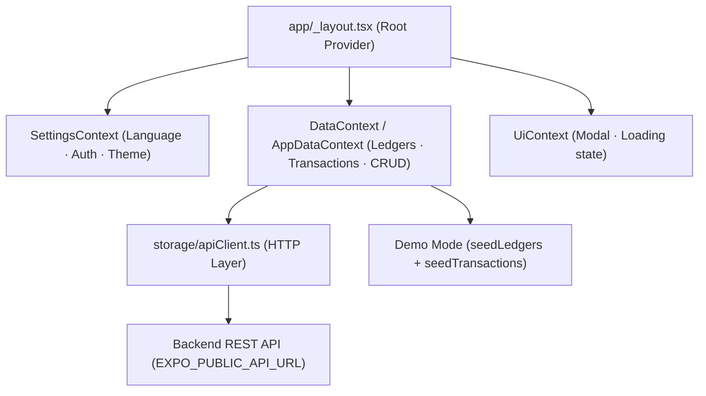

# MobiLedger — Complete Documentation

> **Version:** 1.0.0 &nbsp;|&nbsp; **Platform:** iOS / Android / Web &nbsp;|&nbsp; **Author:** ＢＩＫＡＳＨ　ＴＨＡＰＡ

---

## Table of Contents

1. [Overview](#1-overview)
2. [Key Features](#2-key-features)
3. [Tech Stack](#3-tech-stack)
4. [Project Structure](#4-project-structure)
5. [Architecture](#5-architecture)
6. [Navigation & Screens](#6-navigation--screens)
7. [Data Models](#7-data-models)
8. [Context Providers (State Management)](#8-context-providers-state-management)
9. [Storage & API Layer](#9-storage--api-layer)
10. [Authentication](#10-authentication)
11. [Localization (i18n)](#11-localization-i18n)
12. [Accounting Logic & Financial Reports](#12-accounting-logic--financial-reports)
13. [PDF Export](#13-pdf-export)
14. [Getting Started](#14-getting-started)
15. [Environment Variables](#15-environment-variables)
16. [Build & Deployment (EAS)](#16-build--deployment-eas)
17. [API Reference](#17-api-reference)

---

## 1. Overview

**MobiLedger** is a professional, bilingual accounting and transaction management mobile application built with **React Native** and **Expo**. It converts daily financial entries (Cash Book / Journal) into automated, structured accounting books — Trial Balance, Profit & Loss, Balance Sheet, and Cash Flow reports — all in real time.

The app targets individual proprietors, small businesses, and professionals who want a portable digital ledger supporting both **English and Japanese** accounting terminology.

---

## 2. Key Features

| Feature | Description |
|---|---|
| **Dual Entry Modes** | Cash Book (simple daily tracking) and Journal (full double-entry accounting) |
| **Trial Balance** | Real-time aggregation of all debit/credit balances |
| **Profit & Loss (P&L)** | Auto-calculated net profit/loss from Income and Expense accounts |
| **Balance Sheet** | Assets vs. Liabilities snapshot including Net Profit/Loss |
| **Cash Flow** | Cash and bank movement insights |
| **Ledger Management** | Create, update, and delete accounts grouped by Nature and Group |
| **Bilingual UI (EN/JA)** | Full interface and standard account names translated to Japanese |
| **PDF Export** | Ledger statements exported as professional PDF files |
| **Cloud Sync** | Secure login-based backend sync across devices |
| **Demo Mode** | Unauthenticated users see 56 seed ledgers and sample transactions |

---

## 3. Tech Stack

### Core

| Package | Version |
|---|---|
| Expo | ~54.0.30 |
| React Native | 0.81.5 |
| React | 19.1.0 |
| TypeScript | ~5.9.2 |

### Navigation

| Package | Version |
|---|---|
| Expo Router | ~6.0.23 |
| @react-navigation/bottom-tabs | ^7.4.0 |
| @react-navigation/native | ^7.1.8 |
| @react-navigation/native-stack | ^7.3.16 |

### UI & Utilities

| Package | Version |
|---|---|
| @expo/vector-icons | ^15.0.3 |
| @react-native-community/datetimepicker | 8.4.4 |
| react-native-safe-area-context | ~5.6.0 |
| react-native-reanimated | ~4.1.1 |

### System Services

| Package | Version |
|---|---|
| expo-file-system | ~19.0.21 |
| expo-print | ~15.0.8 |
| expo-sharing | ~14.0.8 |
| @react-native-async-storage/async-storage | 2.2.0 |

---

## 4. Project Structure

```
ledger/
├── app/                        # Expo Router — screens & navigation
│   ├── (tabs)/
│   │   ├── _layout.tsx         # Bottom tab navigator
│   │   ├── index.tsx           # Home / Dashboard screen
│   │   ├── entries.tsx         # Transaction list screen
│   │   ├── ledgers.tsx         # Ledger list (redirects to dynamic route)
│   │   ├── reports.tsx         # Financial reports screen
│   │   └── setting.tsx         # Settings, Auth, and Account screen
│   ├── entry/
│   │   ├── new.tsx             # New transaction entry form (Cash Book / Journal)
│   │   └── [id].tsx            # Edit / view existing entry
│   ├── ledger/
│   │   └── [id].tsx            # Ledger statement & PDF export
│   ├── _layout.tsx             # Root navigator with providers
│   ├── modal.tsx               # Generic modal screen
│   └── +not-found.tsx          # 404 fallback
│
├── src/
│   ├── api/
│   │   └── authClient.ts       # signup / login API calls
│   ├── config/
│   │   └── userIdentity.ts     # Global user email singleton for API headers
│   ├── context/
│   │   ├── AppDataContext.tsx   # Ledgers + Transactions state & CRUD
│   │   ├── SettingsContext.tsx  # Language, theme, auth profile settings
│   │   ├── LanguageContext.tsx  # (legacy) Language + theme context
│   │   └── UiContext.tsx       # UI state (modals, loading flags, etc.)
│   ├── data/
│   │   ├── seedLedgers.ts      # 56 default standard ledger accounts
│   │   └── seedTransactions.ts # Sample transactions for demo mode
│   ├── i18n/
│   │   └── labels.ts           # UI string translations (EN/JA)
│   ├── models/
│   │   ├── ledger.ts           # Ledger TypeScript interface
│   │   └── transaction.ts      # Transaction TypeScript interface
│   ├── screens/                # Reusable UI screen components
│   ├── storage/
│   │   ├── apiClient.ts        # Generic HTTP client (GET/POST/PUT/DELETE)
│   │   ├── apiStorage.ts       # Adapter: maps storage ops to API calls
│   │   ├── index.ts            # Storage facade export
│   │   └── types.ts            # EntryInput / LedgerInput payload types
│   └── utils/
│       └── ledgerLabels.ts     # Dictionary lookup for EN↔JA account names
│
├── components/                 # Shared UI primitives (Themed, StyledText, etc.)
├── assets/                     # Images, icons, splash screen
├── app.json                    # Expo configuration
├── eas.json                    # EAS Build configuration
├── package.json                # Dependencies & scripts
├── tsconfig.json               # TypeScript config
└── .env                        # Environment variables (not committed)
```

---

## 5. Architecture

MobiLedger follows a **Context-Provider pattern** for state management and **Expo Router** for file-based navigation.



### Data Flow

1. **App startup** → `SettingsContext` hydrates from `AsyncStorage` (language, auth profile).
2. **DataProvider** checks `settings.authProfile`:
   - **Logged in** → calls `storage.loadInitialData()` → fetches from backend via `apiClient`.
   - **Not logged in** → loads 56 seed ledgers + seed transactions (demo mode).
3. **CRUD operations** → `AppDataContext` functions (`addLedger`, `addTransaction`, etc.) call the API and refresh local state.
4. **UI** consumes state via `useData()` and `useSettings()` hooks.

---

## 6. Navigation & Screens

### Bottom Tab Navigator (`app/(tabs)/`)

| Tab | File | Icon | Auth Required |
|---|---|---|---|
| Home | `index.tsx` | `home-outline` | No |
| Entries | `entries.tsx` | `list-outline` | ✅ Yes |
| Ledgers | `ledgers.tsx` | `file-table-outline` | ✅ Yes |
| Reports | `reports.tsx` | `chart-box-outline` | ✅ Yes |
| Settings | `setting.tsx` | `cog-outline` | No |

> **Note:** **Entries**, **Ledgers**, and **Reports** tabs are **protected**. Unauthenticated users tapping these tabs are redirected to the Settings → Account section to log in.

### Stack Screens

| Route | File | Purpose |
|---|---|---|
| `/entry/new` | `app/entry/new.tsx` | Create a new Cash Book or Journal entry |
| `/ledger/[id]` | `app/ledger/[id].tsx` | View ledger statement, filter by date, export PDF |

---

## 7. Data Models

### `Ledger` (`src/models/ledger.ts`)

```typescript
type LedgerNature = 'Asset' | 'Liability' | 'Income' | 'Expense';

type Ledger = {
  id: string;
  name: string;
  groupName: string;
  nature: LedgerNature;
  isParty?: boolean;
  categoryLedgerId?: string | null; // parent ledger id (for sub-accounts)
  isGroup?: boolean;                // true = this is a group/parent ledger
};
```

**Field Reference:**

| Field | Type | Description |
|---|---|---|
| `id` | `string` | Unique identifier (UUID from backend) |
| `name` | `string` | Account name (e.g., "Cash in Hand") |
| `groupName` | `string` | Category group (e.g., "Current Asset") |
| `nature` | `LedgerNature` | Accounting nature — determines report placement |
| `isParty` | `boolean?` | Whether this is a party/contact ledger |
| `categoryLedgerId` | `string?` | Parent ledger ID for hierarchical accounts |
| `isGroup` | `boolean?` | If `true`, this ledger acts as a group/parent |

---

### `Transaction` (`src/models/transaction.ts`)

```typescript
type VoucherType = 'Receipt' | 'Payment' | 'Journal' | 'Contra' | 'Sales' | 'Purchase';

type Transaction = {
  id: string;
  voucherType: VoucherType;
  date: string;          // format: YYYY-MM-DD
  debitLedgerId: string;
  creditLedgerId: string;
  amount: number;
  narration?: string;
};
```

**Voucher Types:**

| Type | Use Case |
|---|---|
| `Receipt` | Cash/cheque received from customers |
| `Payment` | Cash/cheque paid to suppliers or expenses |
| `Journal` | Non-cash adjustments (depreciation, provisions, etc.) |
| `Contra` | Bank ↔ Cash transfers |
| `Sales` | Sales invoices creating debtor entries |
| `Purchase` | Purchase bills creating creditor entries |

---

## 8. Context Providers (State Management)

### `SettingsContext` (`src/context/SettingsContext.tsx`)

Manages persistent user preferences stored in `AsyncStorage` under key `@ledger_settings_v2`.

**State shape:**
```typescript
type Settings = {
  language: 'en' | 'ja';
  syncEmail: string | null;
  authProfile: AuthProfile | null; // null = unauthenticated
};
```

**Exported hook:** `useSettings()` — returns `{ settings, setLanguage, setSyncEmail, setAuthProfile }`.

---

### `AppDataContext` (`src/context/AppDataContext.tsx`)

Central store for all financial data. Provides CRUD operations for ledgers and transactions.

**Key behaviors:**
- **Demo mode** (no `authProfile`): loads first 56 seed ledgers + seed transactions.
- **User mode** (authenticated): fetches live data from backend via `storage.loadInitialData()`.
- After any mutation (add/delete), calls `loadInitialData()` to refresh full state.

**Exported hook:** `useData()` — returns:

| Method | Signature | Description |
|---|---|---|
| `ledgers` | `Ledger[]` | All ledger accounts |
| `transactions` | `Transaction[]` | All transactions |
| `addLedger` | `(input) => Promise<Ledger \| null>` | Create a new ledger |
| `updateLedger` | `(id, input) => Promise<Ledger \| null>` | Update existing ledger |
| `deleteLedger` | `(id) => Promise<void>` | Delete ledger (fails if it has entries) |
| `addTransaction` | `(input) => Promise<void>` | Post a new transaction entry |
| `deleteTransaction` | `(id) => Promise<void>` | Delete an entry by ID |
| `reloadFromServer` | `() => Promise<void>` | Manual full refresh from backend |

---

### `UiContext` (`src/context/UiContext.tsx`)

Manages UI-specific transient state such as active modal visibility and loading indicators.

---

## 9. Storage & API Layer

### `apiClient.ts` (`src/storage/apiClient.ts`)

A generic HTTP client wrapper. All requests include:
- `Content-Type: application/json`
- `x-user-email: <email>` — user identity header (read from `userIdentity.ts` singleton)

```
API_BASE_URL = process.env.EXPO_PUBLIC_API_URL
```

**Exported functions:**

| Function | Method | Endpoint |
|---|---|---|
| `apiGetLedgers()` | GET | `/ledgers` |
| `apiCreateLedger(payload)` | POST | `/ledgers` |
| `apiGetEntries()` | GET | `/entries` |
| `apiGetEntryById(id)` | GET | `/entries/:id` |
| `apiCreateEntry(payload)` | POST | `/entries` |
| `apiGetLedgerStatement(params)` | GET | `/ledgers/:id/statement?from=&to=` |
| `apiGetTransactions()` | GET | `/transactions` |

---

### `apiStorage.ts` (`src/storage/apiStorage.ts`)

Adapter layer that adapts the raw API client functions to application-level `loadInitialData`, `createLedger`, and `createEntry` operations consumed by `AppDataContext`.

---

## 10. Authentication

Authentication is handled by `src/api/authClient.ts`, which communicates with the backend `/auth` routes.

### `AuthUser` Type

```typescript
type AuthUser = {
  id: string;
  username: string;
  email: string;
  fullName: string;
  businessName: string | null;
  phone: string | null;
  createdAt: string;
};
```

### Functions

| Function | Endpoint | Payload |
|---|---|---|
| `signup(payload)` | POST `/auth/signup` | `{ name, businessName?, email, username, password }` |
| `login(payload)` | POST `/auth/login` | `{ usernameOrEmail, password }` |

On successful login, the returned `AuthUser` is stored in `SettingsContext` as `authProfile`, persisted to `AsyncStorage`, and the email is set in the `userIdentity` singleton for API header injection.

> **Note:** The app uses **email-based header authentication** (`x-user-email`) rather than token-based JWT. Each API request includes the user's email to scope data server-side.

---

## 11. Localization (i18n)

MobiLedger supports **English (en)** and **Japanese (ja)**.

### Translation Strategy

Three separate lookup dictionaries exist in `src/utils/ledgerLabels.ts`:

| Dictionary | Purpose |
|---|---|
| `LEDGER_LABELS` | 60+ standard account names → Japanese equivalents |
| `NATURE_LABELS` | Nature types: Asset/Liability/Income/Expense |
| `GROUP_LABELS` | Group categories: Fixed Asset, Current Liability, etc. |

**Rule:** Standard ledgers (e.g., "Cash in Hand", "Sales") get translated via the dictionary. **User-created custom ledgers remain in the language they were entered.**

### Helper Functions (`ledgerLabels.ts`)

| Function | Description |
|---|---|
| `getLedgerLabel(ledger, lang)` | Translates a ledger name |
| `getNatureLabel(nature, lang)` | Translates nature type |
| `getGroupLabel(groupName, lang)` | Translates group category name |
| `getLedgerLabelByName(name, lang)` | Translates by name string directly |

### UI Labels (`src/i18n/labels.ts`)

All interface strings are centralized here and consumed via a `useT()` hook pattern for scoped component-level translations.

---

## 12. Accounting Logic & Financial Reports

All reports are computed **dynamically in `app/(tabs)/reports.tsx`** directly from the `transactions` array — no pre-aggregated data is stored.

### Trial Balance

Iterates all transactions, summing Dr/Cr amounts per ledger. Checks that total debits = total credits.

### Profit & Loss (P&L)

Filters the Trial Balance to only `Income` and `Expense` nature ledgers:
- **Gross Profit** = Sales − Cost of Goods Sold
- **Net Profit/Loss** = Gross Profit − Indirect Expenses + Other Incomes

### Balance Sheet

Filters to `Asset` and `Liability` nature ledgers. Net Profit (from P&L) is incorporated into Capital under Liabilities.

> **Note:** All date comparisons use string splitting (`date.split('-')`) instead of the native `Date` constructor to avoid UTC/Local timezone offset issues on mobile devices.

---

## 13. PDF Export

Implemented in `app/ledger/[id].tsx` using the `expo-print` + `expo-sharing` + `expo-file-system` pipeline.

### Flow

```
1. Build HTML string (full ledger statement table)
2. expo-print.printToFileAsync({ html }) → temp URI
3. FileSystem.moveAsync (rename temp file)
   Filename format: AccountName_YYYYMMDD_HHMMSS.pdf
4. Sharing.shareAsync(namedUri) → native share sheet
```

### Technical Note

Due to the bleeding-edge React 19 / TypeScript 5.9 environment, `expo-file-system` constants are accessed via a type bypass:

```typescript
import * as FileSystem from 'expo-file-system';
const fs: any = FileSystem;
const uri = fs.cacheDirectory + fileName;
```

---

## 14. Getting Started

### Prerequisites

- Node.js ≥ 18
- npm ≥ 9
- Expo CLI (`npm install -g expo-cli`)
- Android Studio / Xcode (for native builds) or Expo Go app

### Setup

```bash
# 1. Clone the repository
git clone https://github.com/Bikash4JP/ledger.git
cd mobiledger

# 2. Install dependencies
npm install

# 3. Fix any version mismatches
npx expo install --check

# 4. Configure environment
cp .env.example .env
# Edit .env — set EXPO_PUBLIC_API_URL

# 5. Start dev server
npx expo start -c
```

### Running on Device

| Platform | Command |
|---|---|
| Android | `npm run android` or scan QR in Expo Go |
| iOS | `npm run ios` or scan QR in Expo Go |
| Web | `npm run web` |

---

## 15. Environment Variables

A `.env.example` file is included in the repo as a public template. **Never put real values in the README or `.env.example`.**

```bash
# Copy the template and fill in your real values
cp .env.example .env
```

| Variable | Description |
|---|---|
| `EXPO_PUBLIC_API_URL` | Base URL of your MobiLedger backend (no trailing slash) |

> **Important:** `.env` is listed in `.gitignore` and must **never** be committed. The `EXPO_PUBLIC_` prefix is required by Expo to expose the variable to the client bundle. Keep your real API URL private.

The app also sets `usesCleartextTraffic: true` for Android in `app.json` (via `expo-build-properties`) to allow plain HTTP communication during development.

---

## 16. Build & Deployment (EAS)

The project is configured for **Expo Application Services (EAS)** builds (`eas.json`).

| Profile | Use |
|---|---|
| `development` | Local development builds with dev client |
| `preview` | Internal testing / APK distribution |
| `production` | App Store / Play Store release |

**App Identifiers:**

| Platform | ID |
|---|---|
| Android Package | `com.bikudev.mobiledger` |
| EAS Project ID | `c294a215-934e-4239-b46d-6af992cc82cd` |

---

## 17. API Reference

All API calls use the base URL from `EXPO_PUBLIC_API_URL`. User identity is passed via the `x-user-email` header.

### Ledgers

| Method | Endpoint | Description |
|---|---|---|
| `GET` | `/ledgers` | Fetch all user ledgers |
| `POST` | `/ledgers` | Create a new ledger |
| `PUT` | `/ledgers/:id` | Update a ledger |
| `DELETE` | `/ledgers/:id` | Delete a ledger |
| `GET` | `/ledgers/:id/statement?from=&to=` | Get filtered ledger statement |

### Entries

| Method | Endpoint | Description |
|---|---|---|
| `GET` | `/entries` | Fetch all entries |
| `GET` | `/entries/:id` | Fetch single entry |
| `POST` | `/entries` | Create a new entry |
| `DELETE` | `/entries/:id` | Delete an entry |

### Transactions

| Method | Endpoint | Description |
|---|---|---|
| `GET` | `/transactions` | Fetch all transactions |

### Authentication

| Method | Endpoint | Payload |
|---|---|---|
| `POST` | `/auth/signup` | `{ name, businessName?, email, username, password }` |
| `POST` | `/auth/login` | `{ usernameOrEmail, password }` |

---

*Built by **ＢＩＫＡＳＨ　ＴＨＡＰＡ** — Pre-release version. For personal and professional financial tracking.*