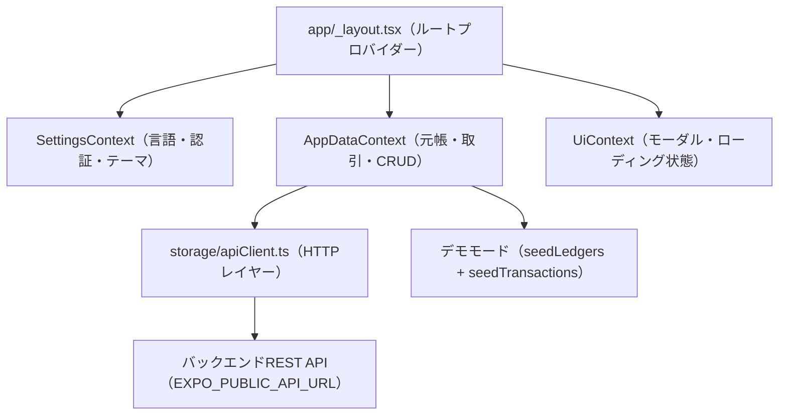

# MobiLedger — 完全ドキュメント

> **バージョン:** 1.0.0 &nbsp;|&nbsp; **対応プラットフォーム:** iOS / Android / Web &nbsp;|&nbsp; **開発者:** ＢＩＫＡＳＨ　ＴＨＡＰＡ

---

## 目次

1. [概要](#1-概要)
2. [主な機能](#2-主な機能)
3. [技術スタック](#3-技術スタック)
4. [プロジェクト構成](#4-プロジェクト構成)
5. [アーキテクチャ](#5-アーキテクチャ)
6. [ナビゲーションと画面](#6-ナビゲーションと画面)
7. [データモデル](#7-データモデル)
8. [コンテキストプロバイダー（状態管理）](#8-コンテキストプロバイダー状態管理)
9. [ストレージとAPIレイヤー](#9-ストレージとapiレイヤー)
10. [認証](#10-認証)
11. [多言語対応（i18n）](#11-多言語対応i18n)
12. [会計ロジックと財務レポート](#12-会計ロジックと財務レポート)
13. [PDFエクスポート](#13-pdfエクスポート)
14. [はじめ方](#14-はじめ方)
15. [環境変数](#15-環境変数)
16. [ビルドとデプロイ（EAS）](#16-ビルドとデプロイeas)
17. [APIリファレンス](#17-apiリファレンス)

---

## 1. 概要

**MobiLedger** は、**React Native** と **Expo** を使用して構築された、プロフェッショナル向けのバイリンガル（英語・日本語）会計・取引管理モバイルアプリです。日々の財務入力（現金出納帳 / 仕訳）を、試算表・損益計算書・貸借対照表・キャッシュフローレポートへリアルタイムに自動変換します。

個人事業主・中小企業・専門家向けに設計されており、**英語と日本語** の会計用語に完全対応しています。

---

## 2. 主な機能

| 機能 | 説明 |
|---|---|
| **2種類の入力モード** | 現金出納帳（日常の簡易入力）と仕訳帳（複式簿記の完全対応） |
| **試算表** | 全勘定の借方・貸方残高をリアルタイム集計 |
| **損益計算書（P&L）** | 収益・費用勘定から純利益・純損失を自動計算 |
| **貸借対照表** | 純利益・損失を含んだ資産・負債のスナップショット |
| **キャッシュフロー** | 現金・銀行の動きを分析 |
| **元帳管理** | 性質・グループ別に勘定を作成・更新・削除 |
| **バイリンガルUI（英語/日本語）** | 画面全体と標準勘定科目名を日本語に完全翻訳 |
| **PDFエクスポート** | 元帳明細書をプロ仕様のPDFファイルとして出力 |
| **クラウド同期** | セキュアなログインによる複数端末間データ同期 |
| **デモモード** | 未ログインユーザー向けに56件の標準元帳とサンプル取引を表示 |

---

## 3. 技術スタック

### コア

| パッケージ | バージョン |
|---|---|
| Expo | ~54.0.30 |
| React Native | 0.81.5 |
| React | 19.1.0 |
| TypeScript | ~5.9.2 |

### ナビゲーション

| パッケージ | バージョン |
|---|---|
| Expo Router | ~6.0.23 |
| @react-navigation/bottom-tabs | ^7.4.0 |
| @react-navigation/native | ^7.1.8 |
| @react-navigation/native-stack | ^7.3.16 |

### UIとユーティリティ

| パッケージ | バージョン |
|---|---|
| @expo/vector-icons | ^15.0.3 |
| @react-native-community/datetimepicker | 8.4.4 |
| react-native-safe-area-context | ~5.6.0 |
| react-native-reanimated | ~4.1.1 |

### システムサービス

| パッケージ | バージョン |
|---|---|
| expo-file-system | ~19.0.21 |
| expo-print | ~15.0.8 |
| expo-sharing | ~14.0.8 |
| @react-native-async-storage/async-storage | 2.2.0 |

---

## 4. プロジェクト構成

```
ledger/
├── app/                        # Expo Router — 画面とナビゲーション
│   ├── (tabs)/
│   │   ├── _layout.tsx         # ボトムタブナビゲーター
│   │   ├── index.tsx           # ホーム / ダッシュボード画面
│   │   ├── entries.tsx         # 取引一覧画面
│   │   ├── ledgers.tsx         # 元帳一覧（動的ルートへリダイレクト）
│   │   ├── reports.tsx         # 財務レポート画面
│   │   └── setting.tsx         # 設定・認証・アカウント画面
│   ├── entry/
│   │   ├── new.tsx             # 新規取引入力フォーム（現金出納帳 / 仕訳）
│   │   └── [id].tsx            # 既存取引の編集・表示
│   ├── ledger/
│   │   └── [id].tsx            # 元帳明細とPDFエクスポート
│   ├── _layout.tsx             # プロバイダー付きルートナビゲーター
│   ├── modal.tsx               # 汎用モーダル画面
│   └── +not-found.tsx          # 404フォールバック
│
├── src/
│   ├── api/
│   │   └── authClient.ts       # サインアップ / ログインAPI呼び出し
│   ├── config/
│   │   └── userIdentity.ts     # APIヘッダー用ユーザーメールシングルトン
│   ├── context/
│   │   ├── AppDataContext.tsx   # 元帳・取引の状態管理とCRUD
│   │   ├── SettingsContext.tsx  # 言語・テーマ・認証プロフィール設定
│   │   ├── LanguageContext.tsx  # （旧）言語・テーマコンテキスト
│   │   └── UiContext.tsx       # UI状態（モーダル・ローディングフラグ等）
│   ├── data/
│   │   ├── seedLedgers.ts      # 56件の標準勘定科目（初期データ）
│   │   └── seedTransactions.ts # デモモード用サンプル取引
│   ├── i18n/
│   │   └── labels.ts           # UI文字列の翻訳（英語/日本語）
│   ├── models/
│   │   ├── ledger.ts           # 元帳TypeScriptインターフェース
│   │   └── transaction.ts      # 取引TypeScriptインターフェース
│   ├── screens/                # 再利用可能なUI画面コンポーネント
│   ├── storage/
│   │   ├── apiClient.ts        # 汎用HTTPクライアント（GET/POST/PUT/DELETE）
│   │   ├── apiStorage.ts       # ストレージ操作をAPI呼び出しにマッピングするアダプター
│   │   ├── index.ts            # ストレージファサードエクスポート
│   │   └── types.ts            # EntryInput / LedgerInput ペイロード型
│   └── utils/
│       └── ledgerLabels.ts     # 英語↔日本語勘定科目名辞書ルックアップ
│
├── components/                 # 共通UIプリミティブ（Themed, StyledText等）
├── assets/                     # 画像・アイコン・スプラッシュ画面
├── app.json                    # Expo設定
├── eas.json                    # EASビルド設定
├── package.json                # 依存関係とスクリプト
├── tsconfig.json               # TypeScript設定
└── .env                        # 環境変数（コミット対象外）
```

---

## 5. アーキテクチャ

MobiLedgerは状態管理に **コンテキスト・プロバイダーパターン**、ナビゲーションにファイルベースの **Expo Router** を採用しています。



### データフロー

1. **アプリ起動** → `SettingsContext` が `AsyncStorage` から設定（言語・認証プロフィール）を読み込む。
2. **DataProvider** が `settings.authProfile` を確認：
   - **ログイン済み** → `storage.loadInitialData()` を呼び出し → `apiClient` 経由でバックエンドからデータ取得。
   - **未ログイン** → 56件のシード元帳とサンプル取引を読み込む（デモモード）。
3. **CRUD操作** → `AppDataContext` の関数（`addLedger`・`addTransaction` 等）がAPIを呼び出し、ローカル状態を更新。
4. **UI** → `useData()` と `useSettings()` フックで状態を参照。

---

## 6. ナビゲーションと画面

### ボトムタブナビゲーター（`app/(tabs)/`）

| タブ | ファイル | アイコン | 認証必要 |
|---|---|---|---|
| ホーム | `index.tsx` | `home-outline` | 不要 |
| 仕訳 | `entries.tsx` | `list-outline` | ✅ 必要 |
| 元帳 | `ledgers.tsx` | `file-table-outline` | ✅ 必要 |
| レポート | `reports.tsx` | `chart-box-outline` | ✅ 必要 |
| 設定 | `setting.tsx` | `cog-outline` | 不要 |

> **注意:** **仕訳**・**元帳**・**レポート** タブは **保護されています**。未ログインユーザーがこれらのタブをタップすると、設定 → アカウントセクションへリダイレクトされます。

### スタック画面

| ルート | ファイル | 目的 |
|---|---|---|
| `/entry/new` | `app/entry/new.tsx` | 現金出納帳または仕訳の新規作成 |
| `/ledger/[id]` | `app/ledger/[id].tsx` | 元帳明細の表示・日付絞り込み・PDFエクスポート |

---

## 7. データモデル

### `Ledger`（`src/models/ledger.ts`）

```typescript
type LedgerNature = 'Asset' | 'Liability' | 'Income' | 'Expense';

type Ledger = {
  id: string;
  name: string;
  groupName: string;
  nature: LedgerNature;
  isParty?: boolean;
  categoryLedgerId?: string | null; // 親元帳ID（補助勘定用）
  isGroup?: boolean;                // true = グループ/親元帳
};
```

**フィールド一覧:**

| フィールド | 型 | 説明 |
|---|---|---|
| `id` | `string` | 一意識別子（バックエンドのUUID） |
| `name` | `string` | 勘定科目名（例：「現金」） |
| `groupName` | `string` | カテゴリーグループ（例：「流動資産」） |
| `nature` | `LedgerNature` | 会計上の性質。レポートの配置を決定する |
| `isParty` | `boolean?` | 取引先元帳かどうか |
| `categoryLedgerId` | `string?` | 階層的な補助勘定のための親元帳ID |
| `isGroup` | `boolean?` | `true` の場合、グループ/親元帳として機能する |

---

### `Transaction`（`src/models/transaction.ts`）

```typescript
type VoucherType = 'Receipt' | 'Payment' | 'Journal' | 'Contra' | 'Sales' | 'Purchase';

type Transaction = {
  id: string;
  voucherType: VoucherType;
  date: string;          // 形式: YYYY-MM-DD
  debitLedgerId: string;
  creditLedgerId: string;
  amount: number;
  narration?: string;
};
```

**伝票タイプ一覧:**

| タイプ | 用途 |
|---|---|
| `Receipt` | 得意先からの現金・小切手受取 |
| `Payment` | 仕入先または経費への現金・小切手支払 |
| `Journal` | 非現金の調整（減価償却・引当金繰入等） |
| `Contra` | 銀行 ↔ 現金の振替 |
| `Sales` | 売掛金を発生させる売上請求書 |
| `Purchase` | 買掛金を発生させる仕入伝票 |

---

## 8. コンテキストプロバイダー（状態管理）

### `SettingsContext`（`src/context/SettingsContext.tsx`）

`AsyncStorage` のキー `@ledger_settings_v2` に永続化されるユーザー設定を管理します。

**状態の型:**
```typescript
type Settings = {
  language: 'en' | 'ja';
  syncEmail: string | null;
  authProfile: AuthProfile | null; // null = 未認証
};
```

**エクスポートフック:** `useSettings()` — `{ settings, setLanguage, setSyncEmail, setAuthProfile }` を返します。

---

### `AppDataContext`（`src/context/AppDataContext.tsx`）

全財務データの中央ストア。元帳と取引のCRUD操作を提供します。

**主な動作:**
- **デモモード**（`authProfile` なし）：最初の56件のシード元帳とサンプル取引を読み込む。
- **ユーザーモード**（認証済み）：`storage.loadInitialData()` 経由でバックエンドからライブデータを取得。
- 追加・削除などのミューテーション後、`loadInitialData()` を呼び出して全状態をリフレッシュ。

**エクスポートフック:** `useData()` — 以下を返します：

| メソッド | シグネチャ | 説明 |
|---|---|---|
| `ledgers` | `Ledger[]` | 全勘定科目 |
| `transactions` | `Transaction[]` | 全取引 |
| `addLedger` | `(input) => Promise<Ledger \| null>` | 元帳の新規作成 |
| `updateLedger` | `(id, input) => Promise<Ledger \| null>` | 既存元帳の更新 |
| `deleteLedger` | `(id) => Promise<void>` | 元帳の削除（取引がある場合は失敗） |
| `addTransaction` | `(input) => Promise<void>` | 新規取引の登録 |
| `deleteTransaction` | `(id) => Promise<void>` | IDによる取引の削除 |
| `reloadFromServer` | `() => Promise<void>` | バックエンドからの手動全件リフレッシュ |

---

### `UiContext`（`src/context/UiContext.tsx`）

モーダルの表示状態やローディングインジケーターなど、UI固有の一時的な状態を管理します。

---

## 9. ストレージとAPIレイヤー

### `apiClient.ts`（`src/storage/apiClient.ts`）

汎用HTTPクライアントラッパー。全リクエストに以下を含みます：
- `Content-Type: application/json`
- `x-user-email: <メールアドレス>` — ユーザー識別ヘッダー（`userIdentity.ts` シングルトンから取得）

```
API_BASE_URL = process.env.EXPO_PUBLIC_API_URL
```

**エクスポート関数一覧:**

| 関数 | メソッド | エンドポイント |
|---|---|---|
| `apiGetLedgers()` | GET | `/ledgers` |
| `apiCreateLedger(payload)` | POST | `/ledgers` |
| `apiGetEntries()` | GET | `/entries` |
| `apiGetEntryById(id)` | GET | `/entries/:id` |
| `apiCreateEntry(payload)` | POST | `/entries` |
| `apiGetLedgerStatement(params)` | GET | `/ledgers/:id/statement?from=&to=` |
| `apiGetTransactions()` | GET | `/transactions` |

---

### `apiStorage.ts`（`src/storage/apiStorage.ts`）

生のAPIクライアント関数を、`AppDataContext` が使用するアプリケーションレベルの `loadInitialData`・`createLedger`・`createEntry` 操作にマッピングするアダプター層。

---

## 10. 認証

認証は `src/api/authClient.ts` が担当し、バックエンドの `/auth` ルートと通信します。

### `AuthUser` 型

```typescript
type AuthUser = {
  id: string;
  username: string;
  email: string;
  fullName: string;
  businessName: string | null;
  phone: string | null;
  createdAt: string;
};
```

### 関数一覧

| 関数 | エンドポイント | ペイロード |
|---|---|---|
| `signup(payload)` | POST `/auth/signup` | `{ name, businessName?, email, username, password }` |
| `login(payload)` | POST `/auth/login` | `{ usernameOrEmail, password }` |

ログイン成功時、返却された `AuthUser` は `SettingsContext` の `authProfile` として保存され、`AsyncStorage` に永続化され、メールアドレスが `userIdentity` シングルトンにセットされてAPIヘッダーに使用されます。

> **注意:** このアプリはJWTトークン認証ではなく、**メールアドレスによるヘッダー認証**（`x-user-email`）を採用しています。各APIリクエストにユーザーのメールアドレスを含め、サーバー側でデータをスコープします。

---

## 11. 多言語対応（i18n）

MobiLedgerは **英語（en）** と **日本語（ja）** に対応しています。

### 翻訳戦略

`src/utils/ledgerLabels.ts` に3つの辞書が定義されています：

| 辞書 | 目的 |
|---|---|
| `LEDGER_LABELS` | 60件以上の標準勘定科目名 → 日本語対応表 |
| `NATURE_LABELS` | 性質タイプ：資産/負債/収益/費用 |
| `GROUP_LABELS` | グループカテゴリー：固定資産、流動負債等 |

**ルール:** 「現金」・「売上高」等の標準勘定は辞書で翻訳されます。**ユーザーが作成したカスタム勘定は入力した言語のまま表示されます。**

### ヘルパー関数（`ledgerLabels.ts`）

| 関数 | 説明 |
|---|---|
| `getLedgerLabel(ledger, lang)` | 勘定科目名を翻訳 |
| `getNatureLabel(nature, lang)` | 性質タイプを翻訳 |
| `getGroupLabel(groupName, lang)` | グループカテゴリー名を翻訳 |
| `getLedgerLabelByName(name, lang)` | 名前文字列から直接翻訳 |

### UIラベル（`src/i18n/labels.ts`）

全UI文字列がここに集約されており、`useT()` フックパターンでコンポーネントレベルの翻訳に使用されます。

---

## 12. 会計ロジックと財務レポート

全レポートは **`app/(tabs)/reports.tsx` 内で動的に計算**されており、`transactions` 配列から直接集計されます。事前集計データは保存されません。

### 試算表

全取引を反復処理し、元帳ごとに借方・貸方の合計を集計。借方合計と貸方合計が一致するかを確認します。

### 損益計算書（P&L）

試算表を `Income`（収益）と `Expense`（費用）の性質の元帳のみに絞り込み：
- **売上総利益** = 売上高 − 売上原価
- **当期純損益** = 売上総利益 − 販売管理費 + その他収益

### 貸借対照表

`Asset`（資産）と `Liability`（負債）の性質の元帳に絞り込み。P&Lの当期純利益は負債側の資本に組み込まれます。

> **注意:** 日付比較は、モバイル端末でのUTC/ローカルタイムゾーンのずれを避けるため、ネイティブの `Date` コンストラクタではなく文字列分割（`date.split('-')`）を使用しています。

---

## 13. PDFエクスポート

`app/ledger/[id].tsx` に実装されており、`expo-print` + `expo-sharing` + `expo-file-system` のパイプラインを使用します。

### フロー

```
1. HTML文字列を生成（完全な元帳明細テーブル）
2. expo-print.printToFileAsync({ html }) → 一時URI
3. FileSystem.moveAsync（一時ファイルのリネーム）
   ファイル名形式: 勘定科目名_YYYYMMDD_HHMMSS.pdf
4. Sharing.shareAsync(namedUri) → ネイティブ共有シート
```

### 技術的な注記

React 19 / TypeScript 5.9 の最新環境のため、`expo-file-system` の定数は型バイパスでアクセスしています：

```typescript
import * as FileSystem from 'expo-file-system';
const fs: any = FileSystem;
const uri = fs.cacheDirectory + fileName;
```

---

## 14. はじめ方

### 前提条件

- Node.js ≥ 18
- npm ≥ 9
- Expo CLI（`npm install -g expo-cli`）
- Android Studio / Xcode（ネイティブビルド用）または Expo Go アプリ

### セットアップ

```bash
# 1. リポジトリをクローン
git clone https://github.com/Bikash4JP/ledger.git
cd mobiledger

# 2. 依存パッケージをインストール
npm install

# 3. バージョン不整合を修正（必要な場合）
npx expo install --check

# 4. 環境変数を設定
cp .env.example .env
# .env を編集して EXPO_PUBLIC_API_URL を設定

# 5. 開発サーバーを起動
npx expo start -c
```

### 端末での実行

| プラットフォーム | コマンド |
|---|---|
| Android | `npm run android` または Expo Go でQRコードをスキャン |
| iOS | `npm run ios` または Expo Go でQRコードをスキャン |
| Web | `npm run web` |

---

## 15. 環境変数

プロジェクトのルートに `.env` ファイルを作成してください：

```env
EXPO_PUBLIC_API_URL=https://your-backend-url.com
```

> **重要:** `EXPO_PUBLIC_` プレフィックスは、Expo がクライアントバンドルに変数を公開するために必要です。シークレットや秘密鍵はこのファイルにコミットしないでください。

また、`app.json` 内で（`expo-build-properties` 経由で）Android の `usesCleartextTraffic: true` を設定しており、開発中のHTTP通信を許可しています。

---

## 16. ビルドとデプロイ（EAS）

このプロジェクトは **Expo Application Services（EAS）** ビルド用に設定されています（`eas.json`）。

| プロファイル | 用途 |
|---|---|
| `development` | 開発クライアントを使用したローカルビルド |
| `preview` | 内部テスト / APK配布 |
| `production` | App Store / Play Store リリース |

**アプリ識別子:**

| プラットフォーム | ID |
|---|---|
| Android パッケージ | `com.bikudev.mobiledger` |
| EAS プロジェクトID | `c294a215-934e-4239-b46d-6af992cc82cd` |

---

## 17. APIリファレンス

全API呼び出しは `EXPO_PUBLIC_API_URL` のベースURLを使用します。ユーザー識別情報は `x-user-email` ヘッダーで渡されます。

### 元帳（Ledgers）

| メソッド | エンドポイント | 説明 |
|---|---|---|
| `GET` | `/ledgers` | 全元帳を取得 |
| `POST` | `/ledgers` | 新規元帳を作成 |
| `PUT` | `/ledgers/:id` | 元帳を更新 |
| `DELETE` | `/ledgers/:id` | 元帳を削除 |
| `GET` | `/ledgers/:id/statement?from=&to=` | フィルタリングされた元帳明細を取得 |

### 仕訳（Entries）

| メソッド | エンドポイント | 説明 |
|---|---|---|
| `GET` | `/entries` | 全仕訳を取得 |
| `GET` | `/entries/:id` | 単一仕訳を取得 |
| `POST` | `/entries` | 新規仕訳を作成 |
| `DELETE` | `/entries/:id` | 仕訳を削除 |

### 取引（Transactions）

| メソッド | エンドポイント | 説明 |
|---|---|---|
| `GET` | `/transactions` | 全取引を取得 |

### 認証（Authentication）

| メソッド | エンドポイント | ペイロード |
|---|---|---|
| `POST` | `/auth/signup` | `{ name, businessName?, email, username, password }` |
| `POST` | `/auth/login` | `{ usernameOrEmail, password }` |

---

*開発者：**ＢＩＫＡＳＨ　ＴＨＡＰＡ** — プレリリース版。個人・業務の財務管理を目的として構築されています。*
